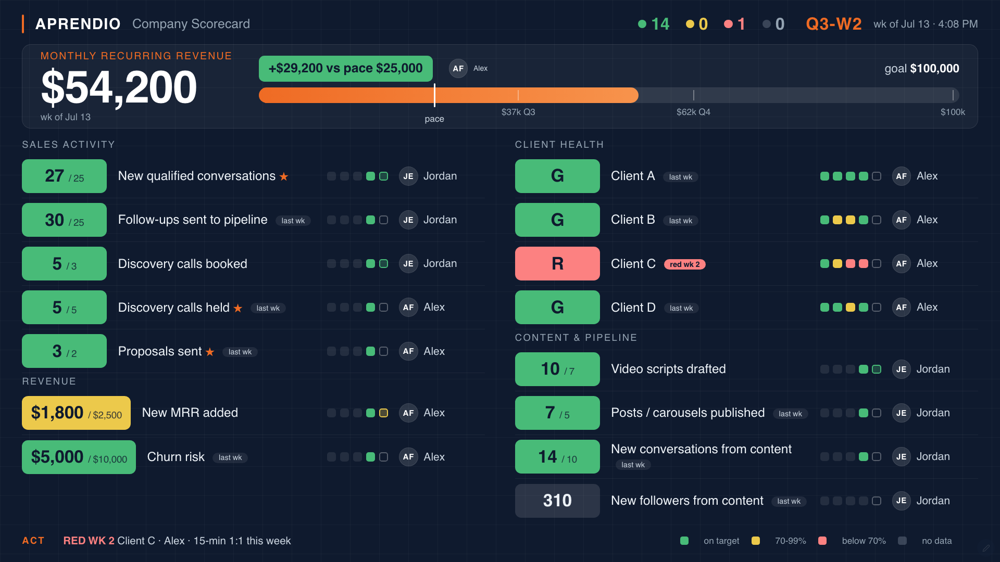

# Scorecard

A self-hosted company scorecard in the EOS / Dan Martell tradition: one screen that
shows whether the business is on track, updated weekly by a small team, displayed
full-time on an office TV, and readable/writable by AI agents over a JSON API.

Built with FastAPI, Jinja2, htmx, and SQLite. One container, no build chain, no
JavaScript framework. A small team can run this for years on a $5 VPS.



*The TV board with demo data: a goal band with pace marker and milestones,
then every metric with its owner, latest value vs target, and four weeks of
trend. Reds carry their escalation step in the ACT line. The board is sized
in viewport units, so it fills any TV exactly once - no zoom, no scrolling.*

## Why another scorecard

Spreadsheet scorecards die from two wounds: "Week 1-4" tabs that never line up
with real calendars, and red cells that just sit there being red. This app fixes
both:

- **Weeks roll continuously**, Monday-Sunday, labeled by quarter (`Q3-W1 ... W13`)
  under month header bands. Nobody ever wonders which week or tab they are in.
- **Red triggers process, not guilt.** Week 1 red: the owner files a 1-3-1 (one
  problem, three options, one recommendation) in-app. Week 2: a 15-minute 1:1.
  Week 3: structural conversation. Slack alerts fire once per step, deduplicated.
- **Missing data is not the same as bad data.** Entries are due Monday end of day;
  by Wednesday 8am a missing cell turns gray ("no data") and pings the owner.
  Gray and red are different problems and look different.

## Features

- **TV display mode**: a dark wall board designed for across-the-room reading.
  Goal band (e.g. MRR to $100k) with pace marker, owner chip on every metric,
  status-colored value chips, 4-week trend dots. Tokenized URL, no login on
  the TV, refreshes every 60s, survives token rotation, reloads itself daily.
- **Tap-to-edit grid**: one number per metric per week; htmx inline editing.
- **Scoring**: green >= 100% of target, yellow 70-99%, red < 70%; lower-is-better
  metrics invert; binary metrics are green/red only; status metrics (client
  health) are set directly as R/Y/G.
- **Quarterly targets with a ramp**: baseline for weeks 1-6, stretch for weeks 7+.
- **Roles**: admin / editor / viewer, admin-managed accounts with one-time temp
  passwords, forced change on first sign-in.
- **Slack alerts** behind a master toggle (ships OFF): stale sweep Wed 8am,
  red-escalation sweep Tue 8am, channel post + DM to the metric's owner.
- **Agent API**: bearer-token JSON API returning fully scored state (including
  who is stale and what is red) and accepting metric writes. Ideal for wiring up
  an AI agent or n8n/Zapier flows to feed metrics automatically.
- **Full audit trail**: every write is recorded; retroactive edits recompute all
  colors and streaks but never rewrite history.

## Quick start (local)

Requires Python 3.12+ and [uv](https://docs.astral.sh/uv/) (or plain pip).

```bash
git clone https://github.com/kocherm/scorecard && cd scorecard
uv sync
cp migrate/seed_data.example.json migrate/seed_data.local.json
# edit seed_data.local.json: your people, clients, targets (never committed)
uv run python -m migrate.seed        # prints temp passwords + tokens ONCE
uv run uvicorn app.main:app --port 8096
```

Open http://localhost:8096 and sign in with a printed temp password. The seed
also prints the TV URL (`/display?token=...`) and an API bearer token.

## Deploy (Docker)

```bash
docker compose up -d --build         # binds 127.0.0.1:8096
docker compose exec scorecard python -m migrate.seed
```

Put your reverse proxy in front (template in `deploy/nginx.conf`), point a DNS
record at the box, and issue a cert:

```bash
sudo cp deploy/nginx.conf /etc/nginx/sites-available/scorecard.example.com
# edit the server_name, symlink into sites-enabled, then:
sudo nginx -t && sudo systemctl reload nginx
sudo certbot --nginx -d scorecard.example.com
```

The database lives in the `scorecard-data` Docker volume. Backup = copy one
SQLite file. Moving servers = move the volume and the gitignored local files.

## Using it

- **Weekly rhythm**: owners enter last week's numbers by Monday EOD. Wednesday
  8am, anything missing goes gray and (if alerts are enabled) pings Slack.
  Review the board in one weekly meeting; discuss only yellows and reds.
- **Admin > Metrics**: sections and metrics (numeric/binary/status, sum or
  average, higher- or lower-is-better, owner, "key metric" star for leading
  indicators). Archive keeps history; nothing is ever deleted.
- **Admin > Targets**: baseline + stretch per metric per quarter. Editing a
  target rescores the whole quarter, deliberately: no renegotiating history.
- **Admin > Users**: add people, change roles, reset passwords, deactivate.
- **Admin > Settings**: TV display token (rotate any time), the TV goal band
  (which metric, the long-range goal, milestone ticks), months of history in
  the edit grid, Slack credentials, and the alerts master switch.
- **TV**: point the TV browser at `/tv` - it redirects to the tokenized
  display URL. The board sizes itself to the panel; no zoom or scrolling.

## Agent / automation API

```bash
# full scored state: values, colors, stale list, red streaks, escalation levels
curl -H "Authorization: Bearer $TOKEN" https://scorecard.example.com/api/v1/scorecard

# list metric ids
curl -H "Authorization: Bearer $TOKEN" https://scorecard.example.com/api/v1/metrics

# write a value (week_start optional, defaults to the week that is due)
curl -X POST -H "Authorization: Bearer $TOKEN" -H "Content-Type: application/json" \
  -d '{"week_start": "2026-07-06", "value": 12}' \
  https://scorecard.example.com/api/v1/metrics/1/entries
```

Tokens are created in Admin > API, scoped read/write, shown once, revocable.
API-written cells are attributed to the token in the audit trail.

## Working on this repo with an AI assistant

The repo ships a [`CLAUDE.md`](CLAUDE.md) that Claude Code (and most coding
agents) read automatically. It encodes the two rules that matter most:

1. **Privacy**: this is a public repo. Company-specific data (people, clients,
   revenue, hostnames) lives only in gitignored `*.local.*` files. Check
   `git grep` before committing.
2. **Purity**: `app/weeks.py` and `app/scoring.py` are pure functions with the
   clock passed in; they are the unit-tested core that feeds the TV, the edit
   grid, the API, and the alerts identically. Keep them that way.

Run `uv run pytest -q` before committing; the tests cover the week engine
(DST, 14-Monday quarters, boundary weeks) and scoring (direction, staleness,
streaks).

## License

MIT. See [LICENSE](LICENSE).
